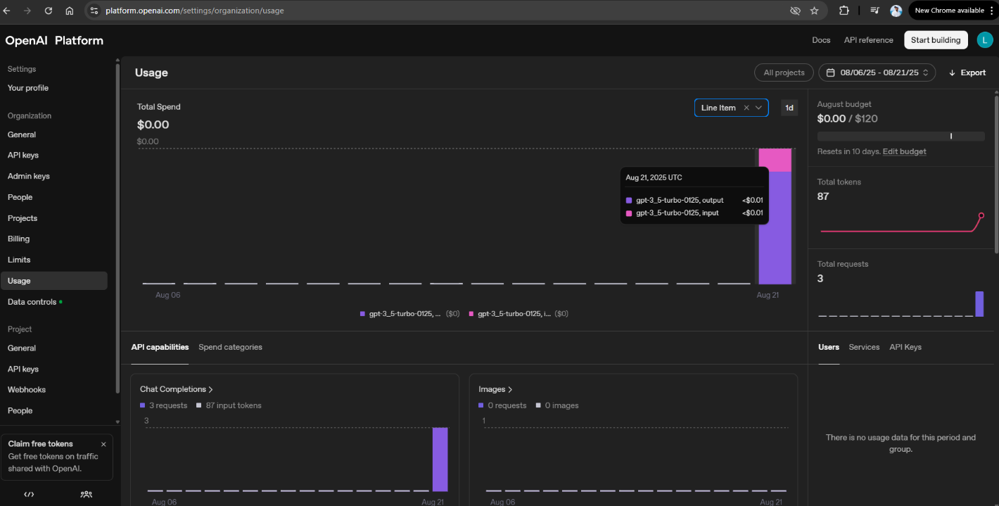
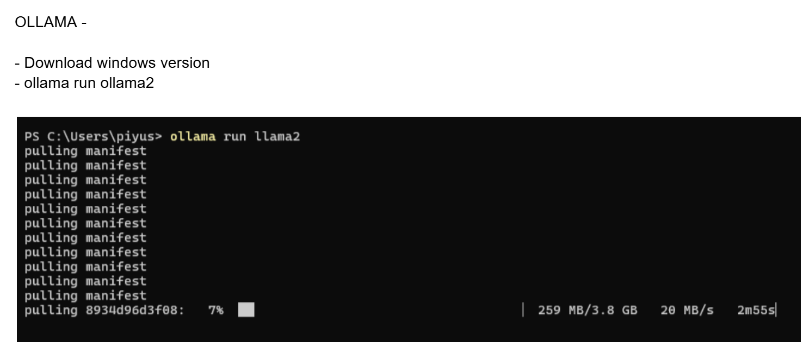
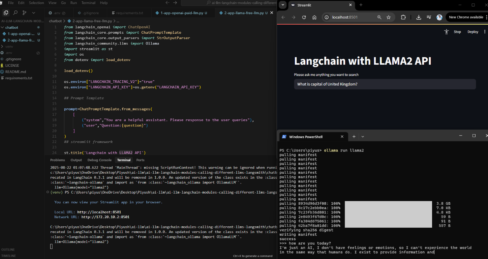
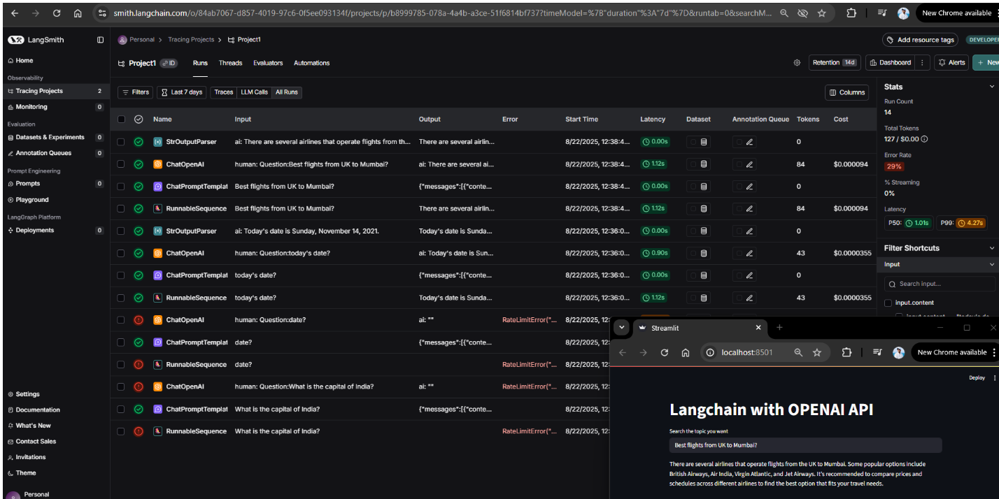

# AI LLM LangChain Chatbots

Simple chatbot applications using LangChain with different LLM providers.

## 🚀 Quick Start

1. **Setup Environment**
   ```bash
   python -m venv venv
   .\venv\Scripts\Activate.ps1  # Windows
   pip install -r requirements.txt
   ```

2. **Create `.env` file**
   ```env
   OPENAI_API_KEY=your_key_here
   LANGCHAIN_API_KEY=your_key_here
   ```

3. **Run Applications**
   ```bash
   # OpenAI Chatbot (Paid)
   streamlit run chatbot/1-app-openai-paid-llm.py
   
   # Ollama Chatbot (Free Local)
   streamlit run chatbot/2-app-llama-free-llm.py
   ```

## 🔧 Ollama Setup

```bash
# Install Ollama from ollama.ai
ollama pull llama2
ollama serve
```

## 📁 Files

- `1-app-openai-paid-llm.py` - OpenAI GPT-3.5-turbo chatbot
- `2-app-llama-free-llm.py` - Local Llama2 chatbot via Ollama
- `requirements.txt` - Python dependencies

## 🌟 Features

- Multiple LLM support (OpenAI, Ollama)
- Streamlit web interface
- LangSmith tracing
- Easy model switching

## 📱 Screenshots






---
